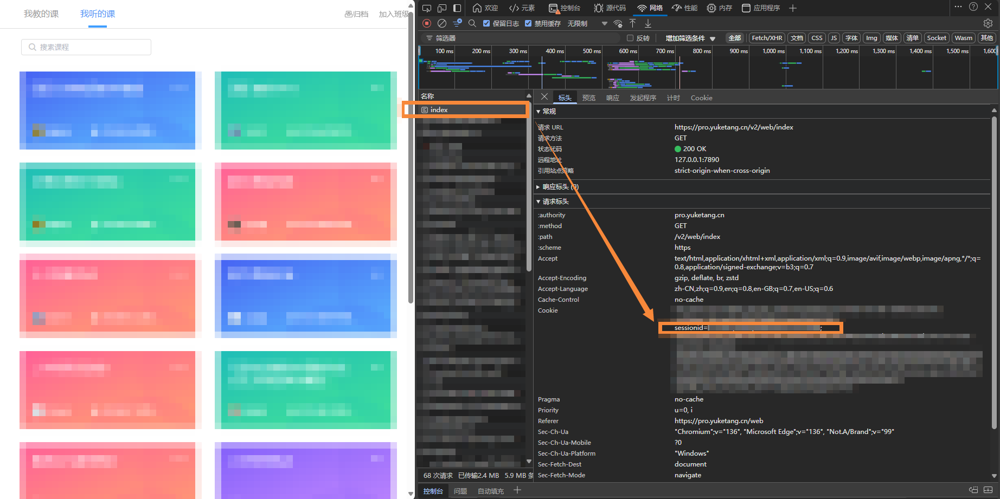
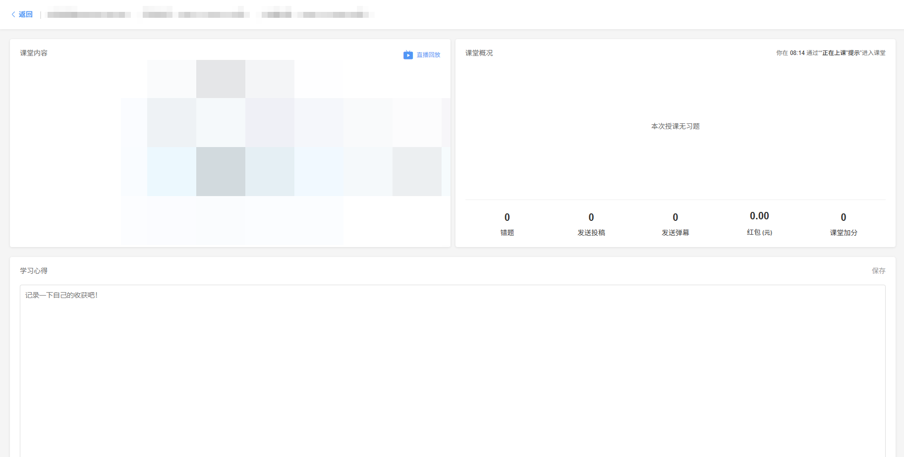

# proyuketang-videoCrawler

从荷塘雨课堂中下载课堂回放。

**该项目仅供个人学习参考，下载内容严禁传播或营利，使用完毕请及时删除。请自觉遵守相关法律法规，一切法律责任由用户自行承担。**

## 使用说明

### 1. 安装依赖

需要安装 `requests` 库，可运行以下命令进行安装：

```
pip install requests
```

### 2. 配置 `config.json`

打开 `config.json` 文件，需要设置 `session_id` 和 `lesson_id`。

为获取 `session_id`，如下图所示，可以在登录荷塘雨课堂后，按 `F12` 键打开浏览器开发者工具，切换到 `网络` 标签，刷新页面，找到名称为 `index` 的请求，在请求标头中找到 `Cookie` 字段，复制 "sessionid=" 之后、最近分号之前的值，填入 `config.json` 文件的 `session_id` 字段。



为获取 `lesson_id`，进入回放所在的课堂主页（如下图）。



查看该页面的网址，类似 `https://pro.yuketang.cn/v2/web/student-v3/31*****/131****************/80*****` 。将倒数第二段的二十一位数字填入 `config.json` 文件的 `lesson_id` 字段即可。

### 3. 运行程序

运行如下命令，程序会分段下载课堂回放，并命名为 `f'{title}_{cnt}.mp4'` 保存到当前目录中，其中 `title` 为课堂标题（用 `.` 代替非法文件名字符），`cnt` 为回放分段序号。

```
python video_crawler.py
```

## LISENCE

本仓库的内容采用 [CC BY-NC-SA 4.0](https://creativecommons.org/licenses/by-nc-sa/4.0/) 许可协议。您可以自由使用、修改、分发和创作衍生作品，但只能用于非商业目的，署名原作者，并以相同的授权协议共享衍生作品。

如果您认为文档的部分内容侵犯了您的合法权益，请联系项目维护者，我们会尽快删除相关内容。
